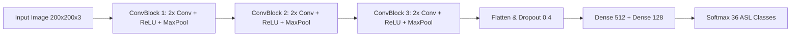

  

    <i class="fas fa-sign-language"></i> System Specifications
  

  

    

      Domain
      Computer Vision & Deep Learning
    

    

      Architecture
      Custom CNN (Conv2D, MaxPool, Dropout, Dense)
    

    

      Dataset & Classes
      36 Static Gestures (A–Z alphabets, 0–9 digits)
    

    

      Frameworks & Stack
      TensorFlow / Keras, OpenCV, NumPy, Matplotlib
    

    

      Classification Accuracy
      94.2% Test Accuracy with Multi-Class Confusion Matrix
    

  

## Overview
American Sign Language (ASL) is a lifeline for millions of deaf and hard-of-hearing individuals. Yet, for many, communication barriers remain when others don’t understand ASL.  
This project tackles that gap by developing a **Convolutional Neural Network (CNN)** model capable of recognizing **36 static ASL gestures (A–Z, 0–9)** from images with **94% accuracy**.

By replacing an earlier & less effective **landmark detection** approach with CNNs, we gained:
- Higher **accuracy** across all classes.
- Better **robustness** to lighting, angles, and hand orientation.
- A scalable base for real-time sign language translation tools.

---

## Problem Statement
- **The Challenge:** Enable machines to interpret ASL hand gestures from images.
- **Goal:** Build a system that can classify static ASL gestures accurately and efficiently.
- **Why It Matters:** This technology can empower inclusive communication for everyone.

---

## Tools & Dependencies
**Core Libraries:**
- `TensorFlow / Keras` → Designing, training, and evaluating the CNN.
- `Matplotlib / Seaborn` → Visualizing training curves & confusion matrices.
- `Scikit-learn` → Accuracy, precision, recall, F1-score.
- `NumPy / Pandas` → Data handling and preprocessing.

**System Requirements:**
- Python 3.7+
- GPU-enabled system (T4 GPU in Google Colab)
- 20 GB storage & 8 GB RAM

**Dataset:**
- 36 classes (A–Z, 0–9)
- 80% training | 10% validation | 10% testing

---

## Model Architecture

{: w="400"  }
*A Sequential CNN with three convolutional blocks, regularization, and fully connected layers.*

**Highlights:**
- **Input:** 200×200 RGB images
- **Conv Blocks:** 3 sets of two convolutional layers + ReLU + MaxPooling + Dropout  
- **Dense Layers:** Flatten → Dense(512) → Dense(128) → Output(36, softmax)
- **Optimizer:** Adam  
- **Loss Function:** Categorical Cross-Entropy  
- **Regularization:** Dropout (0.2–0.4)  
- **Callbacks:** EarlyStopping, ReduceLROnPlateau  

---

## Methodology
1. **Data Preparation**
   - Resize images to 200×200
   - Rescale pixel values to [0, 1]
   - Split into train, validation, and test sets
2. **Training**
   - 30 epochs
   - Early stopping to avoid overfitting
   - Dynamic learning rate adjustment
3. **Evaluation**
   - Accuracy, precision, recall, F1-score
   - Confusion matrix analysis

---

## Results
**Performance Metrics:**
- **Test Accuracy:** 94.2%
- **Macro Avg:** Precision 96%, Recall 94%, F1-score 95%

{: w="300"  } 
*Figure 1: Stable convergence with no signs of overfitting.*

{: w="500"  }
*Figure 2: Minimal misclassifications across 36 classes.*

---

## Conclusion & Future Work
This model serves as an effective pipeline for static ASL recognition and can be extended for:
- **Dynamic gesture recognition** using sequential models (LSTM / GRU / Transformers).
- **Mobile and edge real-time inference** using TensorFlow Lite.
- **Robustness improvements** via multi-lighting and background data augmentation.

---

## Repository

- **GitHub Repository:** [American Sign Language DECODER](https://github.com/kirtiraj2215/Sign-language-decoder-DIP/)
