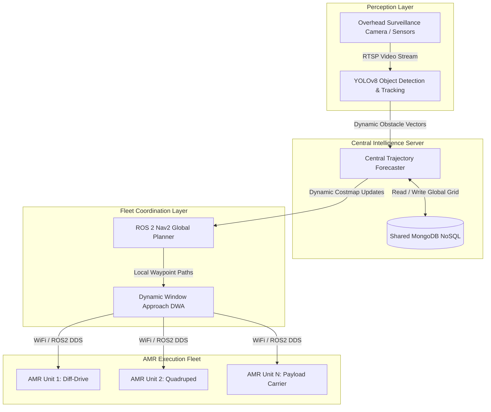

<div class="project-specs">
  <div class="specs-heading">
    <i class="fas fa-network-wired"></i> System Specifications
  </div>
  <div class="specs-grid">
    <div class="spec-item">
      <span class="spec-label">Domain</span>
      <span class="spec-value">Multi-Agent Systems & Swarm Navigation</span>
    </div>
    <div class="spec-item">
      <span class="spec-label">Middleware & Stack</span>
      <span class="spec-value">ROS 2 Humble, Nav2, Dynamic Window Approach (DWA)</span>
    </div>
    <div class="spec-item">
      <span class="spec-label">Perception & Vision</span>
      <span class="spec-value">YOLOv8 Real-time Obstacle & Dynamic Object Labeling</span>
    </div>
    <div class="spec-item">
      <span class="spec-label">Data Architecture</span>
      <span class="spec-value">Shared MongoDB NoSQL for Multi-Robot Map Persistence</span>
    </div>
    <div class="spec-item">
      <span class="spec-label">Simulation Testbed</span>
      <span class="spec-value">Gazebo 10x10m+ Dynamic Warehouse (4+ AMRs)</span>
    </div>
    <div class="spec-item">
      <span class="spec-label">Context & Challenge</span>
      <span class="spec-value">Inter-IIT Tech Meet 13.0 (Kalyani Bharat Forge Statement)</span>
    </div>
  </div>
</div>

## The Problem Statement: Multi-Robot Navigation System for Dynamic Industrial Environments
To design a system for a centralized Intelligence based path planning & navigation in a dynamic condition like a warehouse with moving instruments, forklifts & humans

{: w="500"  }
_Swarm Robots in Warehouse Simulation_

## Background

Bharat Forge Ltd., a flagship company of the Kalyani Group, is a global leader in precision engineering and advanced manufacturing. With complex factory and warehouse environments that are constantly evolving, their need was clear:

> **How can autonomous robots navigate and perform tasks efficiently in dynamic indoor environments — without GPS, markers, or manual intervention?**

The Inter-IIT Tech Meet 2025 problem statement challenged us to engineer a **centralized intelligence system for a swarm of autonomous mobile robots (AMRs)** to navigate and complete tasks in such unpredictable spaces.

---

## Our Approach

We designed a **ROS 2-based multi-agent system** backed by a **shared NoSQL database**, capable of:
- Real-time dynamic obstacle avoidance using DWA
- Semantic obstacle labeling with computer vision
- Global map persistence and inter-robot state sharing
- Scalable task assignment and navigation

---

## System Architecture



### Core Components

1. **ROS 2 Humble**: Middleware for multi-robot control, topic streaming, and communication.
2. **Gazebo**: Simulation testbed representing a 10x10m+ industrial workspace with dynamic and static obstacles.
3. **MongoDB**: Shared NoSQL database for map persistence, state sharing, and telemetry logging.
4. **YOLOv8**: Real-time object detection of obstacles, tools, and moving agents.
5. **Reinforcement Learning (RL)**: Policy network for dynamic prioritization and path planning.

---

## Multi-Bot Simulation Setup

We created a custom **Gazebo environment** configured with:
- **4+ autonomous mobile robots** (Differential Drive and Quadruped platforms)
- **3+ dynamic obstacles** (human avatars, moving carts)
- **10+ static target objects** (tools, extinguishers, crates)
- Deterministic and random spawning logic for scalability verification

Each robot published its odometry, task state, and sensory feedback via ROS 2 nodes into MongoDB.

---

## Object Detection & Environment Mapping

To operate markerless, we fine-tuned **YOLOv8** on industrial warehouse objects:
- Fire extinguishers
- Toolboxes
- Human workers
- Industrial equipment

Detections were timestamped and stored in MongoDB as structured records (`object_id`, `type`, `position`, `velocity`). These updates were fed into the global costmap layer in Nav2.

---

## Shared Database & Persistent Memory

{: w="800"  }
_Custom collections made in MongoDB server_

We implemented a logging and synchronization pipeline using two primary MongoDB collections:

```json
{
  "robot_logs": {
    "timestamp": "2024-11-05T15:00:00Z",
    "robot_id": "bot_1",
    "X": 3.1, "Y": 7.2,
    "obstacles": [...],
    "confidence_score": 0.94,
    "scan_ranges": [...],
    "tasks_done": "navigating"
  },
  "dynamic_map": {
    "environment_id": "sector_2",
    "map_data": [...],
    "last_updated": "2024-11-05T14:58:10Z"
  }
}
```

This enabled state recovery, persistent map caching, and seamless task reassignment upon robot fault or restart.

---

## Task Ranking & Autonomous Scheduling

Robots dynamically queried tasks from the central MongoDB queue, evaluated by:
- Estimated travel time / cost to target
- Object priority ranking (e.g., safety equipment > routine inspection points)
- Agent battery level and availability

Using PPO (Proximal Policy Optimization) alongside Nav2's Dynamic Window Approach (DWA), robots recalculated local trajectories in real-time around unmodeled moving agents.

{: w="400"  }
_Dynamic obstacle avoidance using RL formulation_

---

## Simulation Verification

We verified the architecture across 4 industrial test cases in Gazebo:
- **Scalability in Cluttered Spaces:** 20×20m layouts with high obstacle density.
- **Swarm Size Scalability:** 8+ robots operating concurrently without topic contention.
- **Dynamic Obstacle Avoidance:** Navigating around non-linear moving worker models.
- **Map Persistence & Recovery:** Reloading pre-cached environmental maps after process restart.

---

## Technical Summary

| Component / Subsystem | Implementation Status |
| --------------------- | --------------------- |
| Multi-Robot Coordination | Implemented |
| Dynamic Obstacle Avoidance | Integrated (Nav2 + DWA) |
| Map Persistence (NoSQL) | Completed (MongoDB) |
| Object Detection | Custom-trained YOLOv8 |
| Swarm Scalability | Verified in Gazebo |

---

## Repository & References

- **GitHub Repository:** [m2_Kalyani_BharatForge_44](https://github.com/Nandostream11/m2_Kalyani_BharatForge_44)
- **Built with:** ROS 2 Humble, Gazebo, MongoDB, YOLOv8, Nav2

*Robotics Team #2, IIT Bhilai*
