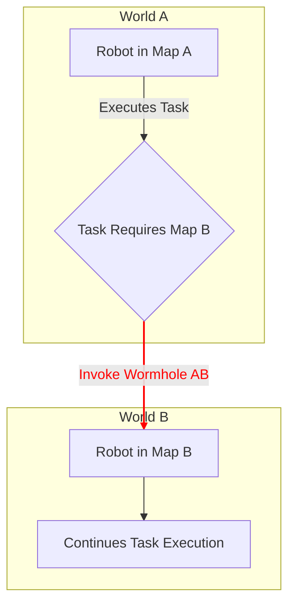
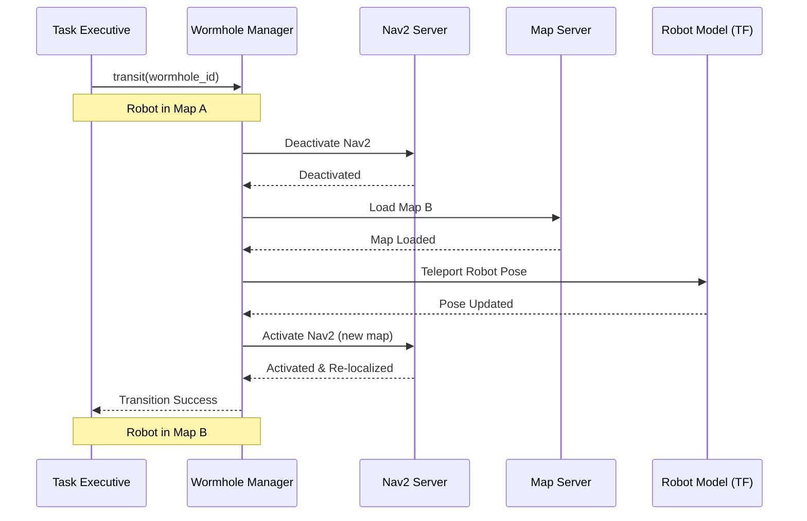

# Introduction

This project explores a novel navigation paradigm inspired by theoretical physics—**Wormhole-based Multi-map Navigation**. In complex robotic applications, such as multi-floor warehouses, large-scale search and rescue, or multi-simulation environments, a robot's operational world is often segmented into distinct topological maps. Transitioning between these maps traditionally requires the robot to navigate to a specific, pre-defined portal, which can be inefficient and breaks mission fluidity.

Our framework enables robots to seamlessly "jump" between discrete spatial maps—or "worlds"—as if traversing a wormhole. This abstraction allows task executives to distribute and switch active computational contexts without being burdened by underlying spatial discontinuities, particularly valuable in simulation-heavy development and large-scale autonomous operations.

# Objectives

The primary motivation was to enhance flexibility and efficiency in robotic task execution across fragmented operational domains. Key objectives included:

- Designing and implementing a "Wormhole" abstraction within ROS 2's Nav2 stack
- Enabling dynamic map switching based on high-level task goals rather than geometric proximity
- Creating a mission management system for orchestrating tasks across multiple disconnected maps
- Validating the framework in simulation with multi-world mission completion

# System Architecture

## Core Concept: The Navigation Wormhole

A "Wormhole" serves as a virtual portal connecting two poses in distinct navigation maps. Unlike physical doorways, it's a logical link in the task planning layer that enables instantaneous context switching between operational environments.

The Wormhole acts as a logical bridge, bypassing the physical space between worlds.

Implementation Framework

Built on ROS 2 Humble Hawksbill and Nav2, our architecture extends rather than replaces core navigation components:
High-Level Components

https:///assets/images/wormhole-concept-arch.png{: w="600" }

    Task Executive: The mission brain that determines when wormhole transitions are needed

    Wormhole Manager: Maintains a registry of available wormholes with:

        source_map and target_map identifiers

        source_pose and target_pose coordinates

        Transition parameters and validation rules

    Nav2 Client & Map Server Interface: Handles navigation lifecycle and map switching

# Transition Sequence

The wormhole transition follows a precise sequence to maintain system stability:
Simulation & Validation
Experimental Setup

We created two distinct simulated environments in Gazebo Ignition:

    World A (Warehouse): Cluttered indoor environment for inventory tasks

    World B (Outdoor Yard): Open delivery area for transport missions

The mission objective was: "Perform inventory scan in warehouse, then deliver package to yard location."

# Results

The system successfully demonstrated seamless multi-map navigation:

    Mission Start: Robot autonomously navigated warehouse inventory points using Nav2

    Wormhole Activation: Task Executive invoked warehouse_to_yard wormhole upon task completion

    Instant Transition: Robot teleported between maps with sub-3-second transition time

    Continued Execution: Immediate resumption of navigation in target environment

https:///assets/images/wormhole-rviz-transition.png{: w="700" }

Performance Metric: Average transition time was under 3 seconds, including map loading and re-localization—negligible for most high-level mission planning.
Challenges & Insights

Key technical challenges and solutions included:

    State Management: Implemented careful sequencing to ensure all Nav2 components reached safe states before transitions

    TF Tree Consistency: Managed frame discontinuities by treating each /map as independent while maintaining robot transform integrity

    Localization Reset: Provided strong initial pose estimates to AMCL based on wormhole target poses to prevent "kidnapped robot" scenarios

The project revealed that multi-map navigation complexity lies primarily in software state management rather than geometric planning.
Future Work

Potential enhancements to the framework include:

    Dynamic Wormhole Creation: Runtime generation of wormholes based on semantic information and task requirements

    3D & Multi-Floor Support: Extending the concept for complex multi-level environments

    Behavior Tree Integration: Embedding wormhole transitions as first-class actions in Nav2's behavior trees

    Visual Triggers: Using AR markers or visual cues as physical wormhole activation points

# Conclusion

The Wormhole-based Multi-map Navigation framework successfully demonstrates spatial abstraction for high-level task execution. By treating separate navigational worlds as interconnected logical domains, we enable more flexible and efficient autonomous systems.

This approach proves particularly valuable for simulation, testing, and large-scale deployments where operational efficiency outweighs physical traversal constraints. It represents a step toward more abstracted spatial reasoning in autonomous robotics.

[Github Repository](https://github.com/Nandostream11/Multi-Map-Navigation-with-Wormhole)

References & Resources:
  [ROS 2 Navigation (Nav2) Documentation](https://navigation.ros.org/)
  [Gazebo Sim](https://gazebosim.org/home)
  [ROS 2 Behavior Trees](https://github.com/BehaviorTree/BehaviorTree.CPP)
